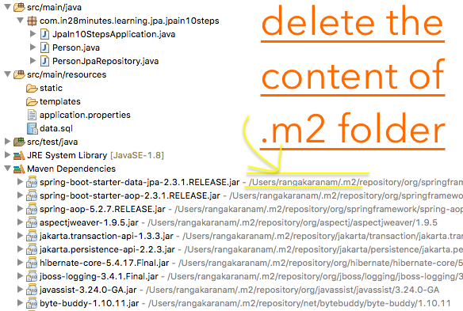

## Unable to login into H2 Console

1. Do you have H2 dependency in `pom.xml`? Try removing `<scope>runtime</scope>` and see if it makes a difference.

```
<dependency>
	<groupId>com.h2database</groupId>
	<artifactId>h2</artifactId>
</dependency>
```

2. Check if H2 Console is enabled in `application.properties` 

```
spring.h2.console.enabled=true
```

3. Are you using >=2.3.0 Release of Spring Boot? You would need to configure this in `application.properties`.

```
spring.datasource.url=jdbc:h2:mem:testdb
```

> Why is this needed? With the latest versions of Spring Boot (2.3+), the H2 database name is randomly generated each time you restart the server.  We do NOT want that. We want a constant URL.

```
H2 console available at '/h2-console'. Database available at 'jdbc:h2:mem:dd222195-7e0b-4dc0-ae4c-7f53e5ea7ceb'
```

4. Make sure you are using `jdbc:h2:mem:testdb` as the database URL in H2 Console as shown in the image below.

In the browser, change the database url to jdbc:h2:mem:testdb (Shown in the screen below).


5. Delete your maven local repository (content of .m2 folder) and rebuild the project. (You are right. This looks silly. But do not skip it. I've seen many problems caused by dependency caches!)



## Tables are not created

### No 1 : Are you using Spring Boot >=2.3.0 Release?

Configure this in `application.properties`

```
spring.datasource.url=jdbc:h2:mem:testdb
spring.data.jpa.repositories.bootstrap-mode=default
```

You should see this in the log
```
H2 console available at '/h2-console'. Database available at 'jdbc:h2:mem:testdb'
```

> Why do we need to configure bootstrap-mode? Details here - https://github.com/spring-projects/spring-boot/wiki/Spring-Boot-2.3-Release-Notes#bootstrapmode-for-jpa-repositories

### No 2 : Make sure you have the right annotations!

Make sure that the Entities have @Entity annotation and the Repository class has @Repository annotation

### No 3 : Make sure your component is picked up by Component Scan

Spring Boot does a component scan in the package and sub-packages where your @SpringBootApplication is defined. 

>  Why is this important? If your entity class or the repository class is NOT under the package of your @SpringBootApplication class, it will NOT be picked up by component scan. 

#### RECOMMENDED OPTION - Option 1 : Move the component under component scan

Simplest way to fix this is to identify the packages of the SpringBootApplication class and move all the components into that package or sub-packages of it. 

#### Option 2 : Add component and entity scan for the packages containing the components
```
@SpringBootApplication(scanBasePackages= {"com.project.currency.*"})
@EntityScan(basePackages = {"com.project.currency.model"})
@EnableJpaRepositories(basePackages = {"com.project.currency.repository"})
```

Learn more about component scan:
- https://github.com/in28minutes/in28minutes-initiatives/tree/master/The-in28Minutes-TroubleshootingGuide-And-FAQ#q---what-is-the-need-for-a-component-scan


## 2.3.0 Course Update

With the latest versions of Spring Boot (2.3+), the H2 database name is randomly generated each time you restart the server.

You can find the database name and URL from the console log.

#### RECOMMENDED: 

Make the database URL a constant by configuring this in application.properties.

```
spring.datasource.url=jdbc:h2:mem:testdb
```

#### If you face any problems:

**Spring Boot 2.3.1 Upgrade - Changes**
- https://github.com/in28minutes/jpa-with-hibernate/commit/1f30e868ccd2eb7e69cdb989bc990cd00cc82168

**JUnit 5 Upgrade - Changes**
- https://github.com/in28minutes/jpa-with-hibernate/commit/0ae2007c8e08420e6d5ab2a86499274c7c60c8ae